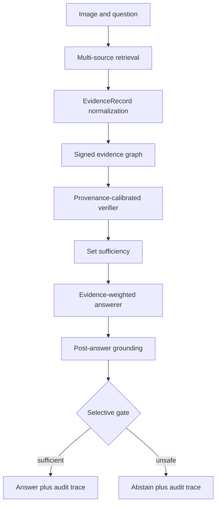

# Architecture

## Module contracts

`EvidenceRecord` is the only evidence object passed between modules. Provenance fields are
required and survive every transformation. `EviTrustPipeline.infer` accepts only the image/question
request and evidence candidates; it deliberately has no ground-truth argument. Gold answers are
handled by evaluation code after inference.

The signed graph uses positive support edges, negative contradiction edges, and zero-sign
redundancy edges. The reference builder is deterministic and transparent. Production experiments
may replace lexical decisions with a frozen NLI/cross-encoder only if its version, training data,
thresholds, and calibration split are recorded.

The selective threshold is learned from a validation stream and then frozen. Test examples cannot
participate in threshold fitting, calibration, early stopping, or model selection.

